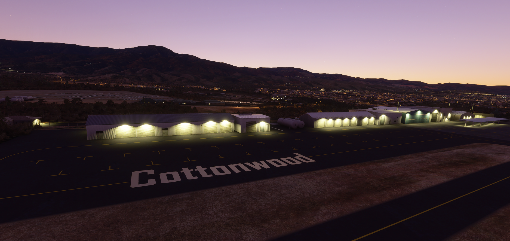
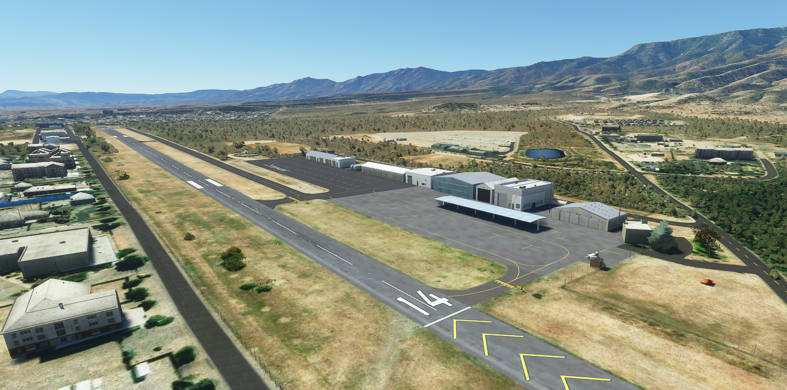
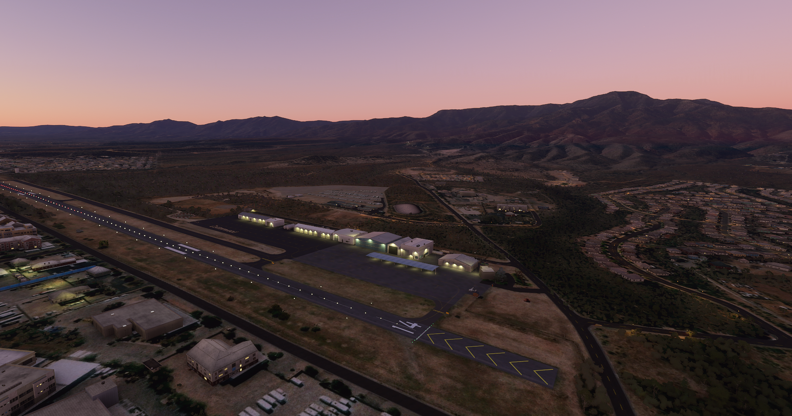
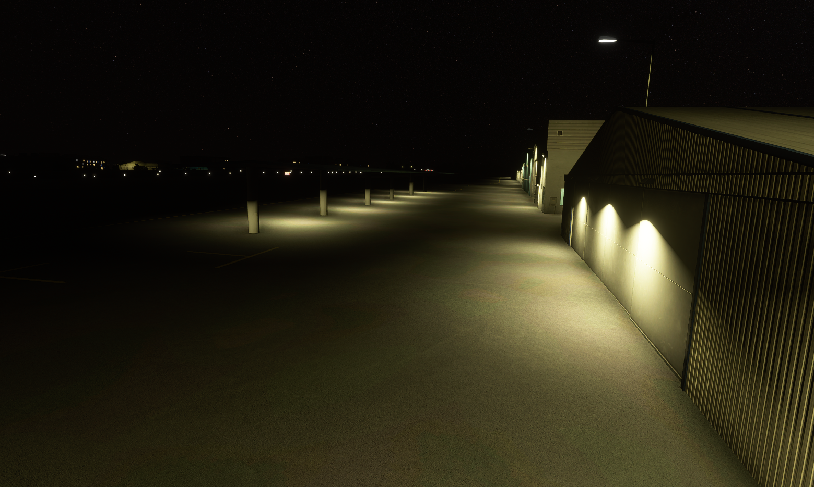
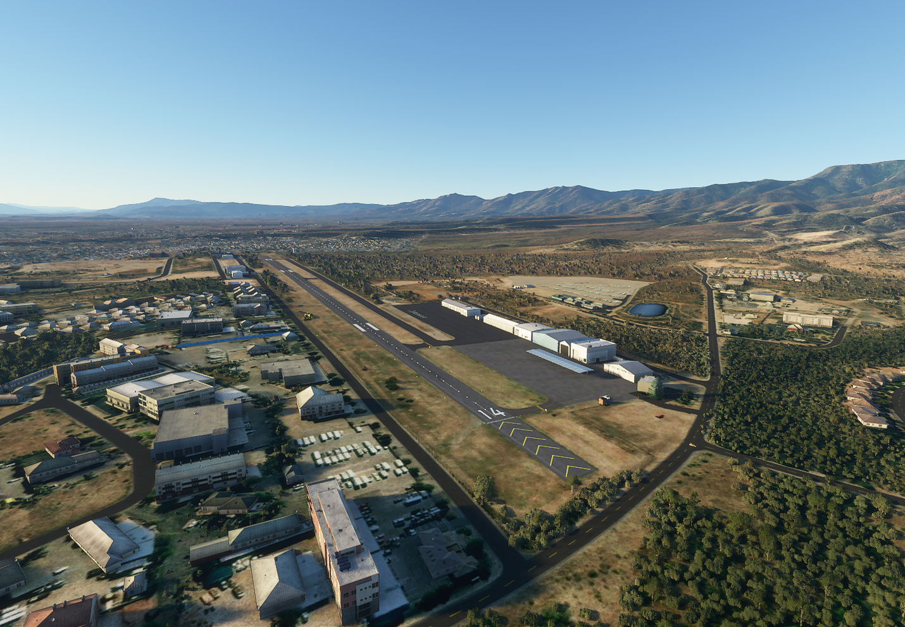
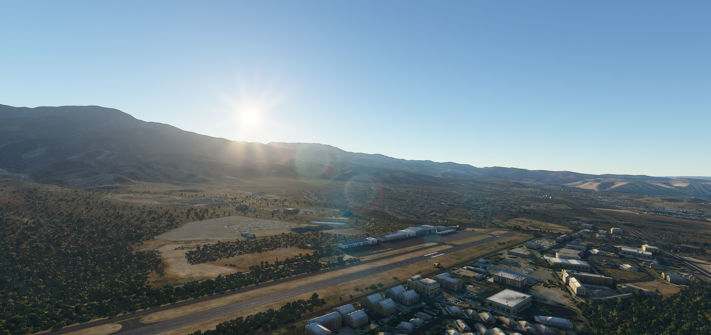

# P52 - Cottonwood Airport
#### Author: Julysfire
Discord: julysfire#9465        MSFS2020: blackflame0729

##### Description
P52 - Cottonwood Airport in Cottonwood, Arizona, United States

Cords: 34°43'48.0"N 112°02'06.0"W

##### Summary
Cottonwood is a small city north of Phoenix tucked between two beautiful mountain ranges in the Verde Valley with plenty of national forests within flying distance.  Originally opened in 1929 as Clemenceau Airport, the name was changed to Cottonwood Airport sometime between 1945 and 1957.

AirNav: <https://www.airnav.com/airport/P52>

Wikipedia: <https://en.wikipedia.org/wiki/Cottonwood_Airport>

Google Maps <https://www.google.com/maps/@34.733116,-112.0371032,727a,35y,246h,1.83t/data=!3m1!1e3>

##### Features

- Hand crafted airport and scenery
- Plenty of GA parking spots
- Custom apron and taxiway textures
- Added custom objects from airport (Cottonwood ground painting, overhang parking structure)
- Fixed many of the roads in the area
- Fixed many of the buildings that didn't auto generate
- Better ground textures and vegetation
- Realistic look and feel
- Realistic night lighting around the hangars/runway/aprons
- Beautiful mountain scenery overlooking the airport
- Approx ~90 miles (~144 kilometers) North of downtown Phoenix, Arizona
 
#### ---Installation Instructions---
1. Download the .zip file from Releases (or zip file here)
2. Extract files to the your Microsoft Flight Simulator Community Folder

For the Microsoft Store edition AND/OR Gamepass edition:

	C:\Users\[YOUR USERNAME]\AppData\Local\Packages\Microsoft.FlightSimulator_<RANDOMLETTERS>\LocalCache\Packages\Community
	
For the Steam edition:

	C:\Users\[YOUR USERNAME]\AppData\Roaming\Microsoft Flight Simulator\Packages\Community

#### -- Important --
I have noticed that changing the package name (julysfire-airport-p52-cottonwood) before or after moving it to the Communities folder will break the link with custom textures.  If you are seeing missing textures, please ensure the package is named "julysfire-airport-p52-cottonwood" without quotes.

## Screenshots

Before and Afters

P52 Screenshots

Even more screenshots in the Screenshots folder!
   
If you enjoyed it as well and would like to donate, it is very much appreciated but never will be required.  I am doing this to add to the community and because I found I enjoyed it.
http://paypal.me/julysfire